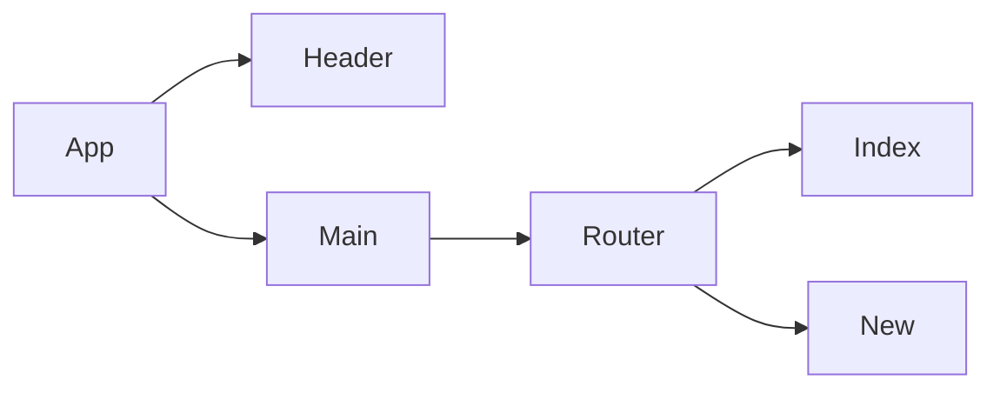

# Bookmark'd Frontend

**Summary**
| Field | Detail |
|-------|--------|
| Project Name | Bookmark |
| Team **Sharknado** | Fernando Galvan, Brianna Gaines, Kelly Luu |
| Live Website | link |
| Frontend Repo | https://github.com/NandoLofi/bookmarks-frontend |
| Backend Repo |  https://github.com/briannag31/bookmarkd-backend2 |
| Trello Board | https://trello.com/b/x0E1bB9H/bookmarkd |

## Technologies & Dependencies to be used:
- JavaScript
- react
- react-router-dom
- Netlify
- css
- Nodemon

## Route Tables

| Endpoint | Method | Response | Other |
| -------- | ------ | -------- | ----- |
| /bookmark | GET | JSON of all items | |
| /bookmark | POST | Create new item return JSON of new item | body must include data for new item |
| /bookmark/:id | GET | JSON of item with matching id number | |
| /bookmark/:id | PUT | update item with matching idea, return its JSON | body must include updated data |
| /bookmark/:id | DELETE | delete the item with the matching id | |

## Component Architecture

## User Interface Mockups
